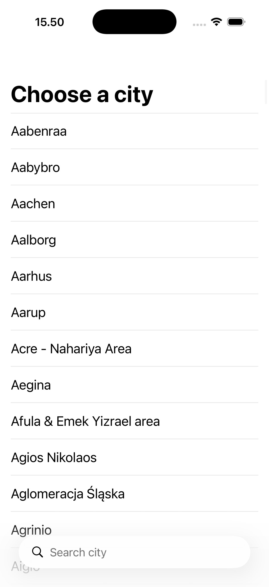
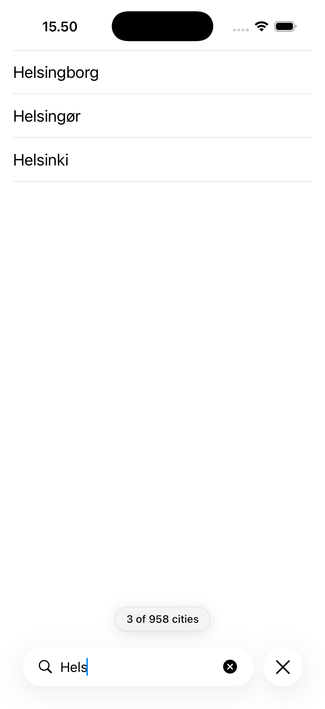
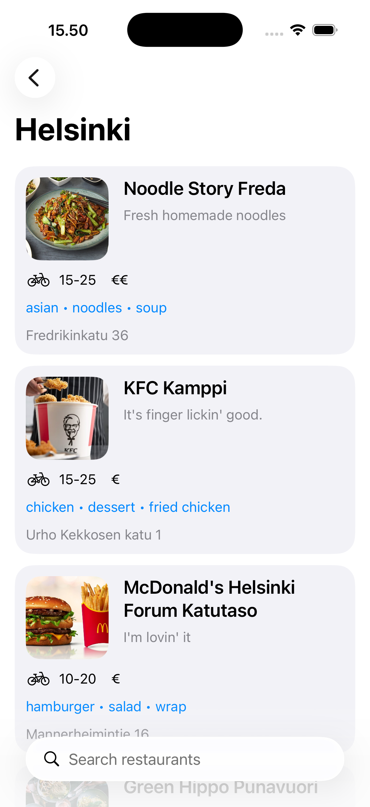
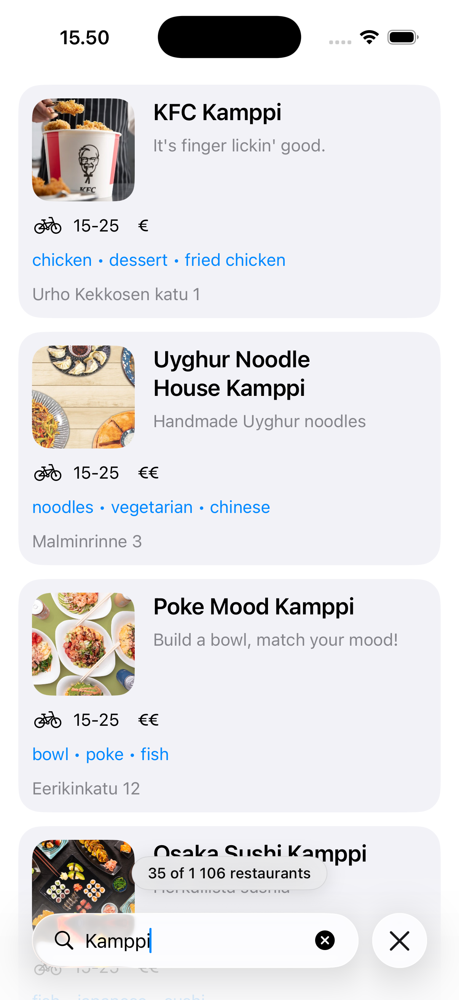

# WoltSwiftUI

> An iOS app built with SwiftUI and the Observation framework: pick a city, browse the restaurants delivering there.

A companion to [WoltCompose](https://github.com/Owaisss10/WoltCompose), which builds the same
app for Android. The two are deliberately not translations of each other — each solves the
same problems the way its own platform prefers, and the differences are the interesting part.

| City Selection | City Search | Restaurant List | Restaurant Search |
|:--------------:|:-----------:|:---------------:|:-----------------:|
|  |  |  |  |

---

## Overview

The app loads Wolt's public city list, lets you search it, and then queries restaurants at the
selected city's coordinates.

The feature scope is small on purpose. What the project is actually about is how state is owned
and derived, where failures are translated, and which trade-offs were made where — including
the ones still open, listed at the end.

**Requirements:** iOS 17+, Xcode 26, Swift 6 language mode.

---

## Architecture

Three layers, with dependencies pointing inward:

```
Presentation  ──▶  Domain  ◀──  Data
(views, view models)         (APIClient, repositories)
```

`Domain` knows nothing about networking or SwiftUI. `Data` implements the protocols `Domain`
declares. `Presentation` depends only on `Domain`. That inversion is what lets a view model be
driven by a fake repository with no network involved.

```
WoltSwiftUI/
├── App/            AppContainer (composition root), RootView, entry point
├── Domain/         City, Restaurant, AppError
├── Data/           APIClient, Endpoint, repositories, logging
├── Navigation/     Router, Route
└── Presentation/   ViewState, Cities/, Restaurants/, Components/
```

---

## Key decisions

### No DTO layer

Models are single `Codable` types rather than a wire type plus a domain type. The API's shape is
resolved during decoding instead of by a separate mapping pass.

This matters most for restaurants, where the JSON nests awkwardly — the artwork sits on the list
item, everything else on a nested venue:

```swift
init(from decoder: any Decoder) throws {
    let container = try decoder.container(keyedBy: CodingKeys.self)
    let venue = try container.nestedContainer(keyedBy: VenueKeys.self, forKey: .venue)

    id = try venue.decode(String.self, forKey: .id)
    ...
}
```

The trade-off is explicit: the domain model is coupled to the API's field names, and a
server-side rename reaches the model directly. In exchange there is one type per concept instead
of two, and the optionality is resolved once at the boundary rather than in every view.

### Failures become one error type at the boundary

`APIClient` uses Swift 6 typed throws, so the compiler guarantees nothing else escapes:

```swift
func get<T: Decodable>(_ endpoint: Endpoint, as type: T.Type) async throws(AppError) -> T
```

A `URLError`, an HTTP status, and a `DecodingError` all become an `AppError` before leaving the
data layer. Views render `AppError`, which is localizable and knows whether retrying is
worthwhile — retrying a malformed response never is.

`AppError.cancelled` is treated as "the caller went away", never as a failure, so leaving a
screen mid-request does not surface an error.

### UI state is a closed set of cases

```swift
enum ViewState<Value: Sendable>: Sendable {
    case loading
    case loaded(Value)
    case failed(AppError)
}
```

A struct of independent flags would let `isLoading` and an error and content all be true at
once. Here the impossible combinations do not compile.

### Derived state, cached rather than recomputed

Filtered results are derived from the loaded data and the query, so the visible list cannot
disagree with the source. But SwiftUI reads them several times per render — for the list, the
result count, and the empty check — so they are stored and refreshed when their inputs change
rather than recomputed on every read:

```swift
var query = "" {
    didSet { refreshVisibleCities() }
}
private(set) var visibleCities: [City] = []
```

Sorting happens once, when data arrives, so filtering never re-sorts.

### Views signal navigation, they do not perform it

`Router` wraps `NavigationPath`; views call `router.navigate(to:)` and know nothing about
destinations. It is a thin wrapper by choice — `NavigationPath` is already the state SwiftUI
navigates from, and a coordinator hierarchy would add indirection without removing a problem.

Because `Route` is `Codable`, the whole stack is written to `@SceneStorage` and restored after
the app is killed, landing the user back where they were.

### Concurrency is explicit about what is not on the main actor

The target defaults to `MainActor` isolation, which suits views and view models. Domain models,
networking, and repositories are marked `nonisolated`, so decoding and requests genuinely run
off the main actor. View models are `@MainActor` and `@Observable`.

---

## How it differs from the Android version

Both apps solve the same problems; several of the iOS choices exist because of what the Android
build got wrong.

| | WoltCompose (Android) | WoltSwiftUI |
|---|---|---|
| UI state | struct of four independent flags | `ViewState` enum |
| Errors | raw `exception.message` reaches the UI | typed `AppError`, localized |
| Cancellation | fixed after a bug: `catch (Exception)` swallowed `CancellationException` | modelled as `AppError.cancelled`, and `.task` cancels automatically |
| Navigation arguments | fixed after a bug: reading the selection from a neighbouring back stack entry emptied the stack | route owns its arguments, restored after process death |
| Search filtering | two screens, two different patterns | one shared component, identical on both |
| Dependency injection | Hilt | composition root in the environment |

---

## Running it

```bash
./run.sh              # build, install and launch on a simulator
./run.sh build        # build only
./run.sh logs         # stream the app's console output
DEVICE="iPhone 17e" ./run.sh
```

No API key or configuration is needed; the Wolt endpoints used are public.

---

## Known limitations

Tracked deliberately rather than left undocumented:

- **There are no tests.** This is the largest gap. The architecture was built to be testable —
  repositories are protocols, view models take them by injection — and none of that is
  currently cashed in.
- **No CI, and no SwiftLint.**
- **Counts are not pluralized.** `"1 of 958 cities"` should read "1 city"; correct handling
  needs a String Catalog with plural variants.
- **No caching or offline support.** Every visit refetches, and there is no persistence layer.
- **The restaurant list is not paginated** — a city's entire venue list is loaded at once.
- **No restaurant detail screen.** Tapping a card does nothing.
- **Images have no explicit cache policy** beyond what `AsyncImage` and `URLSession` do by
  default.
- **`AppContainer` is `@Observable` despite being immutable**, purely to satisfy
  `.environment(_:)`. A custom `EnvironmentKey` would describe it more honestly.
- **Dark mode and Dynamic Type have not been audited** beyond using semantic colors and text
  styles throughout.
